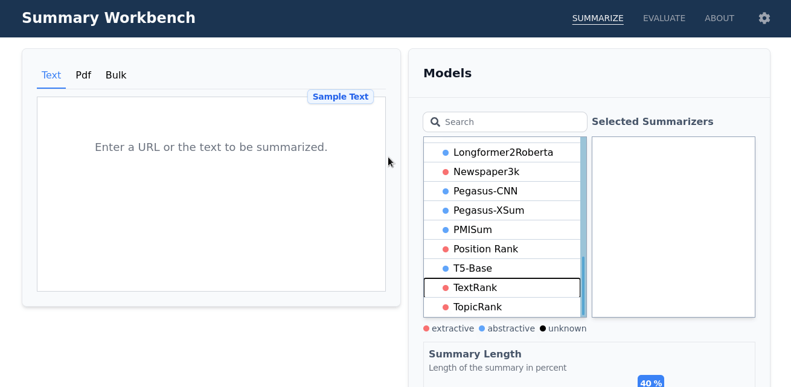

# Summary Workbench

Unifying the application and evaluation of text summarization models. [[Documentation](https://webis-de.github.io/summary-workbench/)] [[Live Demo](https://tldr.demo.webis.de)]
>Accepted at EMNLP 2022 (Demo track).

## Summarize

### Create a Request

### Inspect the Results

# Evaluate

### Create a Request

### Inspect the Results

#### Scores

#### Visualize Text Examples

#### Plot Scores against each other

