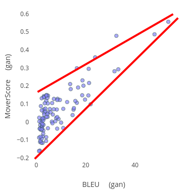
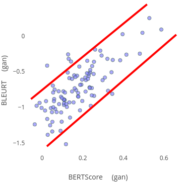
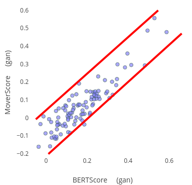
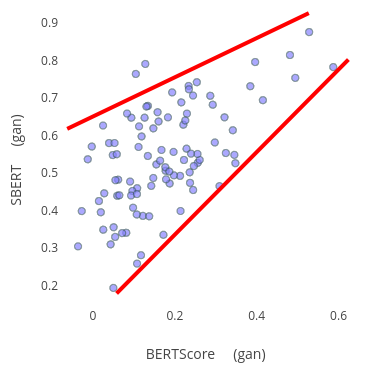
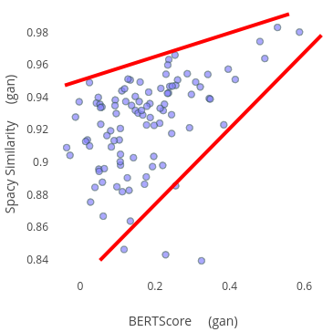
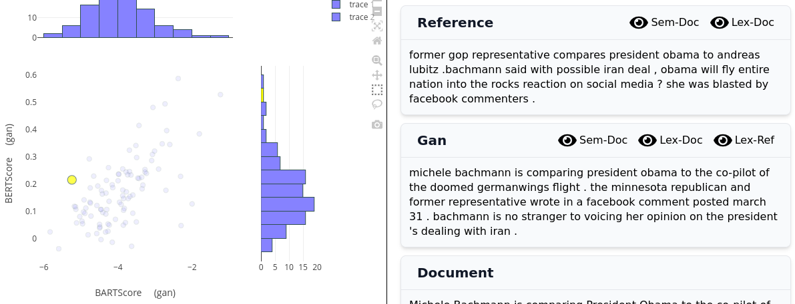
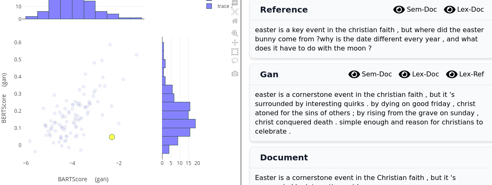
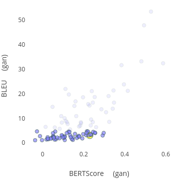
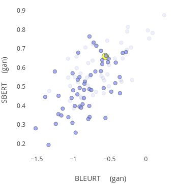
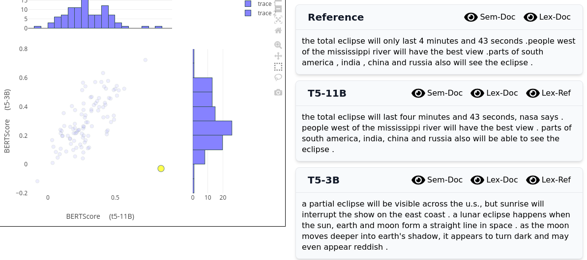

# General

- examples where both scores are high usually have a high overlap
- examples where both semantic scores are low usually have no overlap and discuss completely different topics
- semantic scores compared with lexical scores:
  - the word overlap tool can be used nicely to see the why lexical scores might be high or low
  - there are a lot of examples where the lexical score is low but the semantic score is very diverse
  - the higher the lexical score, the smaller this effect gets
  - this shows that when examples have high lexical similarity, semantic scorers add no new information
  - but when the lexical similarity is low to medium, semantic scorers give much more meaningful results than lexical scorers  
    
- Semantic scores compared with semantic scores are usually well correlated (distributed along line). An exception are SBERT and Spacy Similarity.
  - it is also important to note that it is likely that BERTScore and MoverScore give very similar results, because they both use a BERT-model  
    
    
    
    

# Inspecting Outliers

## Low BARTScore and medium BERTScore

## Medium BARTScore and low BERTScore

# Select Points and look where they are when selecting different Metrics

- how is a selection of scores distributed when changing the selected metrics (the same examples are selected in both pictures)  
  
  

# Comparing the Results with the same Scorer for different Models

## T5-11B vs. T5-3B

- comparing similar models and when they perform different
  
